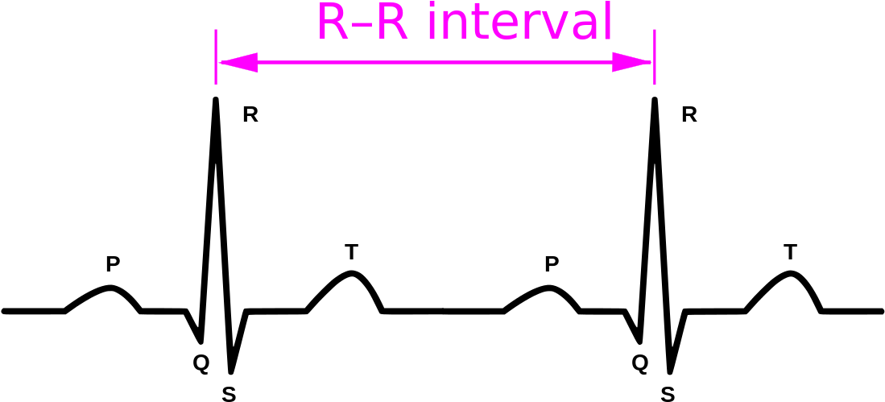

# Modèle personnalisé VS Groupe de patients similaires
Charles VEST
Julien FOIRIER

Projet Aura FullStack 05/06/2020

  - Présentation des données,Datasets, Analyses...
  - Clustering
  - Performance modèle
  - Axes d’amélioration

# Présentation des données

Dataset

  - Base de données open source : TUH Seizure Corpus (TUSZ) v1.5.1 actuellement plus de 30 000 EEG couvrant la période de 2002 à aujourd'hui.
  - Une équipe de neurologue a relu ces enregistrements et a annoté près de 3500 crises d'épilepsie.
  - Nous avons choisi d'exclure les signaux EEG pour ne conserver que le signal ECG.

Preprocessing

  - Perturbations du système nerveux autonome lors des épisodes de crise qui ont pour conséquences des troubles du rythme cardiaque (tachycardie, bradycardie).
  - Ces troubles du rythme cardiaque s'étudient via l'analyse des intervalles R-R.
 

 
*R-R intervalle. Source: https://ya-webdesign.com*  

  - Pour extraire les intervalles R-R du signal ECG nous avons eu recours à des algorithmes standards dits de "détection des complexes QRS"

# Clustering

 
*Gaussian Mixture model  

| V1 | Cluster 0 | Cluster 1 | Cluster 2 |
| ------ | ------ | ------ | ------ |
| Taille | 64 patients| 302 patients | 237 patients |
|age moyen | 52.9 | 47 | 44.3 |
| age médian | 54.0 | 48.5 | 45.5 |
| fréquence de crise | 0.1 | 0.07| 0.07 |
| Genre  | H 56.9% F 43.1% |  H 41.3% F 58.7% | H 35.6% F 64.4% |

| V2 | Cluster 0 | Cluster 1 | Cluster 2 |
| ------ | ------ | ------ | ------ |
| Taille | 302 patients | 205 patients | 96 patients |
|age moyen | 44.1 | 46.7 | 54.2 |
| age médian | 45 | 48.5 | 60 |
| fréquence de crise | 0.04 | 0.07| 0.15 |
| Genre  | H 37.4% F 62.6% | H 40.4% F 59.6% | H 42.9% F 57.1% |

# Performance du modèle

On choisit d'utiliser un modèle de machine learning supervisé, le random forest classifier dans le but de détecter les crises d'épilepsies survenus sur lors des examens.

On évalue l'impact du clustering sur les metrics de performances classiques : F1 score, Specificity, Sensitivity

Patient 8204
  

| Patient 8204 ||
| ------ | ------ |
| F1 score| 0.5 |
| Specifcity | 1.00 |
| Sensitivity | 0.33 |
Cluster V1
 * Cluster 0  
 * Cluster 1 
 * Cluster 2 

| V1 | Cluster 0 | Cluster 1 | Cluster 2 |
| ------ | ------ | ------ | ------ |
| F1 score| 0.84 | 0.53 | 0.50 |
| Specifcity | 0.67 | 1.00 | 1.00 |
| Sensitivity | 0.88 | 0.37 | 0.45 |

Cluster V2
 * Cluster 0 v2 
 * Cluster 1 v2 
 * Cluster 2 v2 

| V2 | Cluster 0 | Cluster 1 | Cluster 2 |
| ------ | ------ | ------ | ------ |
| F1 score| 0.587 |  0.60 | 0.823 |
| Specifcity | 1.00 | 1.00 | 0.94 |
| Sensitivity | 0.45 | 0.43 | 0.88 |

Random 20 patients
  

| Random 20 patients ||
| ------ | ------ |
| F1 score| 0.356 |
| Specifcity | 1.00 |
| Sensitivity | 0.22 |

### Axes d’améliorations

> 1. Datasets moins déséquilibrés 
> 2. Meilleure sélection des features
> 3. Recouper avec les comptes rendus médicaux des patients

