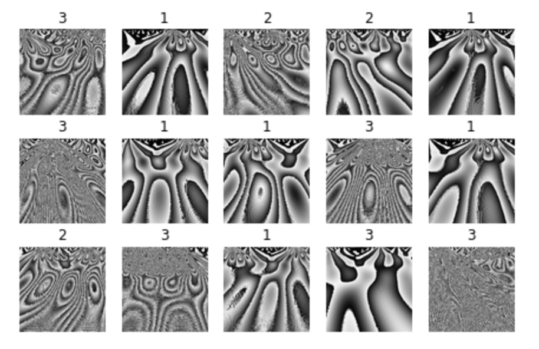
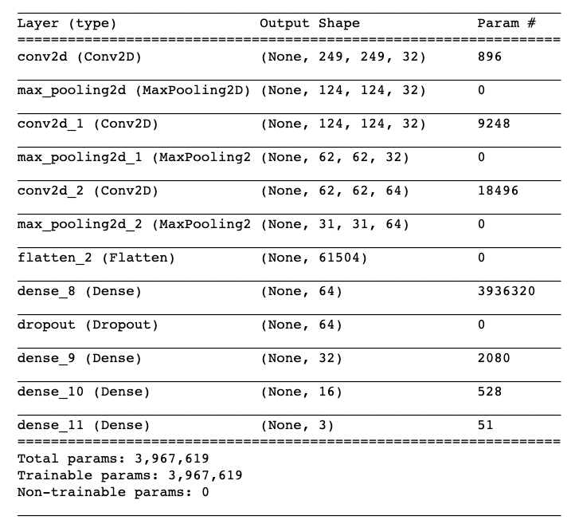
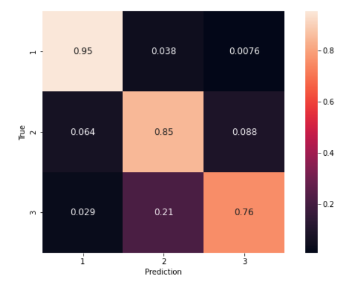
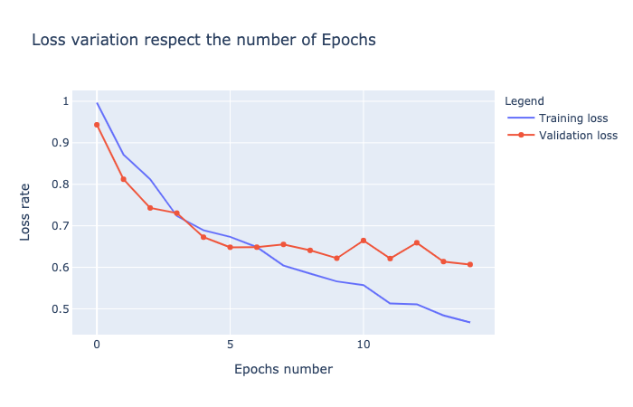

# Introduction

During the Jedha's bootcamp we had the project to classify ECG's Signal by type of noise.
We was 3 on this project :

- Maxence Di Marcantonio
- Henry Dossot
- David Mougey

# ECG Data

We used the data from https://physionet.org/content/butqdb/1.0.0/
(Brno University of Technology ECG Quality Database (BUT QDB))


# References

Publication 23/11/2019 by Marisa Faraggi, Karim Sayadi : Time series features extraction using Fourier and Wavelet transforms on ECG data [[OCTO article](https://blog.octo.com/en/time-series-features-extraction-using-fourier-and-wavelet-transforms-on-ecg-data/)] 

# Starting guide

## Presentation / restitution

- see [Pdf presentation](./jedhateam.pdf)
- see [Jedha Youtube start on 27''](https://youtu.be/ufXkcudT7vE?t=1617)

## Visualisation with Streamlit

```
pip install streamlit
pip install requirements.txt 
streamlit ecg-visualization.py
```


## Data exploration

- see [wavelet_analysis_ECG.ipynb](./wavelet_analysis_ECG.ipynb)

## Dataset created

Images below




## Neuronal Models

- [wavelet_analysis_ECG_model.ipynb](./wavelet_analysis_ECG_model.ipynb) (Training with one ECG file)


  

Satisfying results that give us confidence on predicting noisy signals, results can be improved (see our presentation to discover our areas for improvement  



- [wavelet_analysis_ECG_model_all_patients.ipynb](./wavelet_analysis_ECG_model_all_patients.ipynb)  (Training with 3 ECG file)
- [wavelet_analysis_ECG_v1.ipynb](./wavelet_analysis_ECG_v1.ipynb) (signal 1000ms, 1000Hz)
- [wavelet_analysis_ECG_v2.ipynb](./wavelet_analysis_ECG_v2.ipynb) (signal 2000ms, 250Hz)
