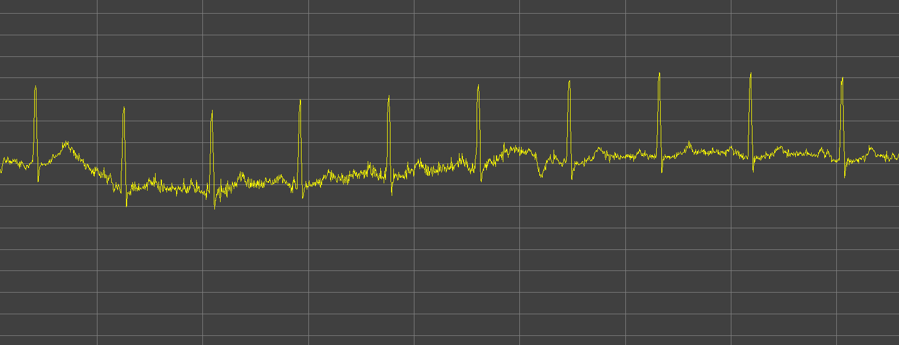
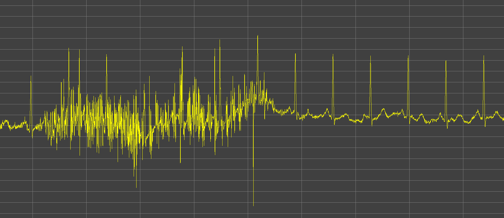

# Machine learning appliqué à la detection des crises d'épilepsie

L'association Aura mène une initiative ouverte et collaborative pour développer un patch connecté permettant de détecter les crises d'épilepsie.

Pour concevoir ce système de detection elle étudie un biomarqueur pertinent: Le signal [ECG - Electrocardiogramme](https://fr.wikipedia.org/wiki/%C3%89lectrocardiographie)

## Une base de données ouverte

Pour construire ce modèle de detection des crises d'épilepsie, nous nous appuyons sur une base de données ouverte: **TUH Seizure Corpus (TUSZ) v1.5.1**.

Cette base de données de **67GB** enregistre les activités electrophysiologiques ([electroencéphalogramme](https://fr.wikipedia.org/wiki/%C3%89lectroenc%C3%A9phalographie), éléctrocardiogramme) de **692 patients** durant **5610 examens** pour une durée totale de **1074 heures**.

Une équipe de neurologue a relu ces enregistrements et a annoté près de **3500 crises d'épilepsie**.
C'est en s'appuyant sur cette base d'annotation binaire (background ou crise) qui nous allons pouvoir entrainer notre modèle.

Il est important de noter que le temps de crises represente **7% du temps total d'enregistrement**. Il faudra tenir compte de cette asymétrie des classes(background/crises) pour entrainer l'algorithme de detection des crises.

Vous trouverez plus d'informations sur cette base de données et l'équipe de recherche qui l'a construite [ICI](https://www.isip.piconepress.com/projects/tuh_eeg/)

### Arborescence de la base de données

La base de données d'origine est structurée de la façon suivante:
```
─ dev                                               // Découpage du dataset en dev/test/validation
│   ├── 01_tcp_ar                                   // Catégorie de montage pour l'enregistrement (pas utile dans le cadre de la mesure ECG)
│   │   ├── 002
│   │   │   └── 00000258                            // Dossier Patient
│   │   │       ├── s002_2003_07_21                 // Dossier session d'enregistrement
│   │   │       │   ├── 00000258_s002_t000.json     // Un enregistrement EEG, ECG
│   │   │       │   └── 00000258_s002_t002.json
│   │   │       └── s003_2003_07_22
│   │   │           ├── 00000258_s003_t000.json
│   │   │           ├── 00000258_s003_t001.json
│   │   │           ├── 00000258_s003_t002.json
│   │   │           ├── 00000258_s003_t003.json
 ...                ...
```

## Un preprocessing sur le signal cardiaque
Dans le cadre de ce projet, nous avons effectuer un premier traitement sur ce gros volume de données, complexe à analyser.

Nous avons choisi dans un premier temps d'exclure les signaux EEG pour ne conserver que le signal ECG.


### Le signal ECG
L'électrocardiographie (ECG) est une représentation graphique de l'activité électrique du cœur. Elle se mesure dans notre cas (montage le plus simple) grace à 2 électrodes posées à gauche et a droite du torse. Cela correspond aux éléctrodes V1 et V2 sur le schéma ci dessous:

</br>
 *ECG electrodes. Source: American Heart Association* </br>


Voici un exemple d'un enregistrement ECG standard.

</br>
*ECG standard. Source: https://ya-webdesign.com* </br>


Dans des conditions de vie quotidienne, ce signal est généralement bruité par des artefacts de mouvements musculaires ou des problèmes de contact des électrodes avec la peau ce qui complexifie l'analyse. Je vous en partage quelques exemples ci-dessous:

</br>
*ECG low noise*</br>


</br>
*ECG mid noise*</br>


</br>
*ECG high noise*</br>

### Les intervalles R-R
Nous allons maintenant rentrer un peu plus dans le détail de l'analyse du signal cardiaque. Les équipes de recherche ainsi que les neurologues travaillant sur l'épilepsie nous apprennent que les crises d'épilepsie entrainent des perturbations du [système nerveux autonome](https://fr.wikipedia.org/wiki/Système_nerveux_autonome) qui ont pour conséquences des troubles du rythme cardiaque (tachycardie, bradycardie).

Ces troubles du rythme cardiaque s'étudient via l'analyse des intervalles R-R.
**Un intervalle R-R répresente la durée d'un battement cardiaque** et correspond au temps entre 2 pics R du signal ECG, cf schéma ci-dessous:

</br>
*R-R intervalle. Source: https://ya-webdesign.com* </br>

Il y a un lien direct en rythme cardiaque et intervalle R-R:

$${bpm} = {\frac{60}{rrinterval}}$$


### Extraire les intervalles R-R à partir du signal ECG
Pour extraire les intervalles R-R du signal ECG nous avons eu recours à des algorithmes standards dits de "détection des complexes QRS". Ces algorithmes sont robustes mais loin d'être infaillibles et ils en existent de nombreuses implémentations.

Nous en avons choisi 3 parmi les plus performants et les plus couramment utilisés:
 * Pan Tompkins
 * Stationnary Wavelet (swt)
 * XQRS

Nous les avons ensuite comparé pour évaluer la robustesse de nos intervalles ainsi que la qualité du signal pour chaque examen.
Nous avons calculé les 2 métriques suivantes:

 * $${CoefCorrelation_{algo1, algo2}} = { \frac{2 \times NombreDeDetectionCommune_{algo1, algo2}}{NombreDeDetectionTotal_{algo1} + NombreDeDetectionTotal_{algo2}}}$$
 coefficient compris entre 0 (résulats totalement différents) et 1 (parfaite correlation entre les R-R intervalles)

 * $MissingBeat_{algo1, algo2}$ la sommes des intervalles de plus de 2 secondes ou nous n'avons pas detecté de battements cardiaques (physiologiquement impossible)
 Plus cette valeur est faible mieux c'est !

### Les données mises à disposition

L'ensemble des données de R-R intervalles pour chaque méthodes de calcul ainsi que leurs métriques de robustesse sont stockés dans des fichiers JSON, un par examen dans le dossier **res-v0_4** présent sur le Drive.

Les fichiers JSON suivent le format suivant:
```json
{"infos":                                    // Information générale sur l'enregistrement
  {"sampling_freq": 400,                     // Frequence d'échantillonage en Hz
    "start_datetime": "2003-07-21T17:12:54", // Date de début d'enregistrement
    "exam_duration": 20,                     // Durée d'examen en secondes
    "ref_file": "00000258_s002_t000.edf"},   // Fichier de reference

"pan-tompkins":                              // Méthode de calcul Pan Tompkins
      {"qrs": [...],                         // QRS frame - pas utile pour ce projet
        "rr_intervals": [652.5, ..., 800],   // R-R intervalles en milliseconds
      "hr": [91.0, ...]},                    // Rythme cardiaque en bpm

"swt": {...},                                // Méthode de calcul Stationnary Wavelet - swt
"xqrs": {...},                               // Méthode de calcul XQRS

"score": {
  "corrcoefs":  [[1, 0.3287671232876712, 0.40540540540540543], // Matrice de coefficients de correlation
                [0.3287671232876712, 1, 0.8524590163934426],   // Pan-Tompkins | SWT | XQRS
                [0.40540540540540543, 0.8524590163934426, 1]], // example corrcoef[0][2] -> Correlation entre Pan Tompkins et XQRS
    "matching_frames": [[43, 12, 15], [12, 30, 26], [15, 26, 31]], //  Pas utile
     "missing_beats_duration": [[0, 0.0, 0.0],                 // Matrice de durée totale
                                [0.0, 0, 0.0],                 // sur lasquelle nous n'avons
                                [0.0, 0.0, 0]]}}               // pas de battements détectés
```

Voici un exemple de représentation du rythme cardiaque avec les 3 méthodes pour un examen donné de 30 minutes:

</br>
*Rythme cardiaque sur un examen de 30 minutes*</br>

## Les annotations de la base de données

La base de données inclut des annotations séparées en 2 classes:
 * background
 * seizure, *crise en français*

Ces annotations se présentent sous forme d'intervalle avec un début, et une fin mesuré par un décallage temporel par rapport au début de l'examen.

### Les données mises à disposition
L'ensemble des données d'annotations est stocké dans des fichiers JSON, un par examen dans le dossier **annot-v0_4** présent sur le Drive.

Les fichiers JSON suivent le format suivant:
```json
{"background": [[0.0, 80.5],        // Intervalles sans crise en secondes
                [121.0, 185.0]],
 "seizure": [80.5, 121.0]}          // Intervalles avec crise en secondes
```
## Calcul des indicateurs médicaux pertinents - les features
Pour aller plus loin, nous allons maintenant extraire un ensemble de features métiers des intervalles R-R.
D'un point de vue médical, l'analyse de la variabilité cardiaque s'appuie sur 3 catégories d'indicateurs proposés par les sociétés de cardiologie européennes et américaines:
 * Les indicateurs du domaine temporel
 * Les indicateurs du domaine fréquentiel
 * Les indicateurs non-linéaires


Nous avons découpé chaque examen **en intervalles de 10secondes** puis calculé 28 indicateurs détaillés ci dessous ainsi que le label associé sur l'ensemble du dataset.

Une précision importante, les indicateurs du domaine temporel sont calculés à partir **d'une fenêtre glissante de 10 secondes**, les indicateurs du domaine fréquentiel sont calculés à partir **d'une fenetre glissante de 2min30 (150 secondes)**, et les indicateurs non linéaires sont calculés à partir **d'une fenêtre glissante de 1min30**.

Ces fenêtres sont choisies pour garantir un calcul des features robustes.

</br>
*Fenêtres de calcul des diffèrents indicateurs* </br>


**Liste des indicateurs:**
```json
FEATURES_KEY_TO_INDEX = {
    'interval_index':0,                            // Index des intervalles
    'interval_start_time':1, #en milliseconds      //

    'mean_nni': 2,                                 // Indicateurs du domaine temporel
    'sdnn': 3,
    'sdsd': 4,
    'nni_50': 5,
    'pnni_50': 6,
    'nni_20': 7,
    'pnni_20': 8,
    'rmssd': 9,
    'median_nni': 10,
    'range_nni': 11,
    'cvsd': 12,
    'cvnni': 13,
    'mean_hr': 14,
    'max_hr': 15,
    'min_hr': 16,
    'std_hr': 17,

    'lf': 18,                                    // Indicateurs du domaine fréquentiel
    'hf': 19,
    'vlf': 20,
    'lf_hf_ratio': 21,

    'csi': 22,                                   // Indicateurs non-linéaires
    'cvi': 23,
    'Modified_csi': 24,
    'sampen': 25,
    'sd1': 26,
    'sd2': 27,
    'ratio_sd2_sd1': 28,

    'label': 29                                  // Label: 0        si pas de crises  
                                                 //        >0 et <1 si intervalle incluant partiellement des crises
                                                 //        1        si intervalle de crise
}
```
Vous trouverez des informations détaillées sur ces indicateurs [ICI](https://github.com/Aura-healthcare/hrvanalysis)

Libre à vous d'en ajouter, le script qui a permis de les générer est présent sur le Drive et s'execute comme suit.
```bash
python3 Cardiac_features_computation_wrapper.py -i res_file.json -a annot_file.json -q QRS_method -o my_new_feats_file.json
```

### Les données mises à disposition
L'ensemble des données de features est stocké dans des fichiers JSON, 3 par examen dans le dossier **feats-v0_4** présent sur le Drive. Pour chaque examen, nous avons enregistré un fichier de features par méthode de calcul des intervalles R-R (Pan tompkins, XQRS ou SWT).

Les fichiers JSON suivent le format suivant:
```json
{"keys": ["interval_index", "interval_start_time", "mean_nni", ... ], # Clé de correspondance index - features

 "features":   # Tableau des features calculées sur chacun des intervalles de l'examen
 [
   [0.0, 0.0, 595.859375, 110.79985592462053, 42.63426504064021, 2.0, 12.5, 2.0, 12.5, 47.899634654139064, 655.0, 327.5, 0.0803874817848407, 0.18594967298218734, 105.20654097423254, 170.2127659574468, 88.23529411764706, 25.419697501831912, NaN, NaN, NaN, NaN, NaN, NaN, NaN, NaN, NaN, NaN, NaN, 0.0],
   # Ensemble des features calculées sur l'intervalle 0 (0s -> 10s) - l'ordre des features est décrit dans les keys

   [1.0, 10000.0, NaN, NaN, NaN, 4.0, 22.22222222222222, 11.0, 61.111111111111114, NaN, NaN, 340.0, NaN, NaN, NaN, 176.47058823529412, 88.23529411764706, NaN, NaN, NaN, NaN, NaN, NaN, NaN, NaN, NaN, NaN, NaN, NaN, 0.0]
   # Ensemble des features calculées pour l'intervalle 1(10s -> 20s) - l'ordre des features est décrit dans les keys
   ...

   [... ] # Dernier intervalle de l'examen
 ]
 }
```

## Le système de detection des crises
 **C'est à vous de jouer maintenant !**
